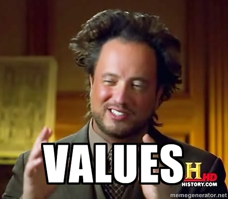
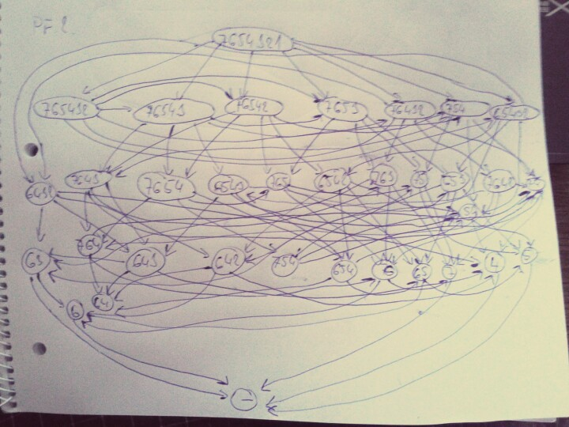

!SLIDE bullets small incremental
* Scalable 
* Highly-available 
* Networked key/value storage
* REST API
* JSON
* MapReduce

!SLIDE center
## That doesn't sound like a big hit

!SLIDE
# Riak != CouchDB

!SLIDE center

(+ metadata (and links too!))

!SLIDE center

!SLIDE center code

<obj/ect/url/bucket,tag,keep?/...>

!SLIDE center
## It's a graph!

!SLIDE bullets incremental
* partitions &#8834; ring
* partitions &#8776; vnode
* node &#8835; vnode
* node &#8838; cluster

!SLIDE center

(schematic diagram for you)

!SLIDE 
# And RESTful?

!SLIDE bullets incremental code
* GET /riak/bucket/key
* PUT /riak/bucket/key
* POST /riak/bucket
* DELETE /riak/bucket/key
